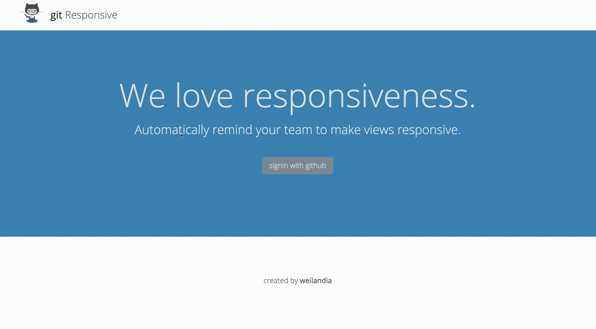

#gitResponsive

gitResponsive is a tool that leverages the GutHub API to search Rails projects and add a reminder to make each of your views responsive by submitting an issue. It works great for teams that manage their workflows via [waffle.io](https://waffle.io/).

Production is hosted [here](http://gitresponsive.herokuapp.com/).

 

####Technical Overview
* Full stack ruby-on-rails
* jQuery
* GitHub API
* Rspec/Capybara/VCR
* Bootstrap
